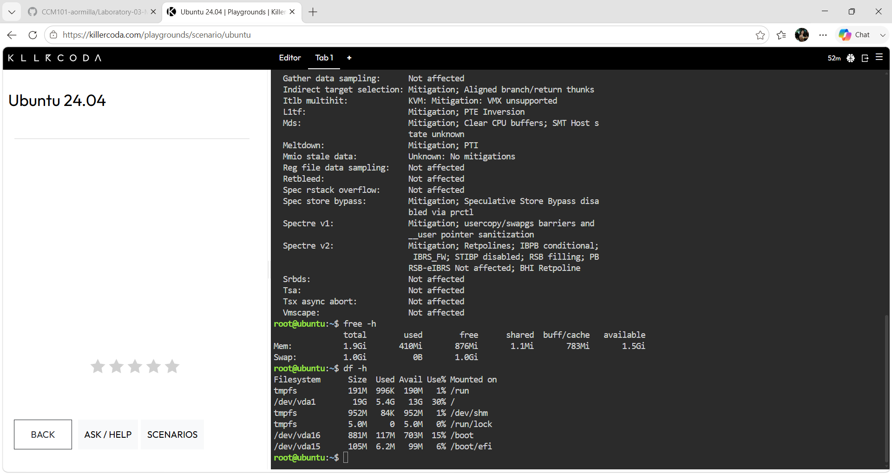

# Laboratory 03 — Multi-Cloud Explorer

## Linux Server Information (from KillerCoda)

### Commands Used
```bash
uname -a          # Operating System
cat /etc/os-release
lscpu             # CPU Information
free -h           # Memory
df -h             # Disk Space


### Server Details
- **Operating System:** Ubuntu 24.04.4 LTS
- **CPU:** 1 vCPU (Intel Xeon)
- **Memory:** ~1.9 GiB RAM
- **Disk Space:** ~19 GB Storage

### Equivalent Cloud Services
If this Linux server were migrated to the cloud:
- **AWS → Amazon EC2** (t3.small — general purpose instance)
- **Azure → Azure Virtual Machines** (B1s — burstable instance)
- **GCP → Compute Engine** (e2-small — general purpose instance)

## Terminal Screenshots

### System Information


### Memory & Disk Space

