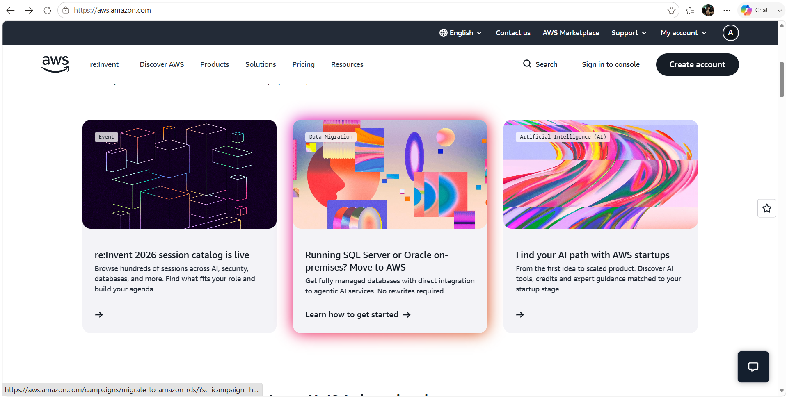

# Amazon Web Services (AWS) Research

## Brief Overview
Amazon Web Services (AWS) is the world’s largest public cloud platform, launched in 2006 by Amazon. It offers a vast collection of scalable infrastructure and application services used by startups, governments, and global enterprises.

## Global Infrastructure
AWS operates across 30+ geographic Regions worldwide, each containing multiple isolated Availability Zones. This wide coverage ensures low latency, fault tolerance, and compliance with local data laws.

## Cloud Management Console
Accessible at **console.aws.amazon.com** — a web-based dashboard to provision, configure, and monitor all services visually.

## Four Core Services
1. **Amazon EC2** — Scalable virtual servers in the cloud.
2. **Amazon S3** — Scalable, high-availability object storage.
3. **Amazon VPC** — Isolated virtual network environment.
4. **Amazon IAM** — Secure access control and identity management.

## Three Advantages
- Widest selection of services and features compared to competitors.
- Mature ecosystem, large community, and years of proven reliability.
- Flexible pricing and a generous Free Tier for new users.

## Typical Enterprise Use Cases
- Enterprise application hosting and backup.
- Media streaming and high-traffic websites.
- Big data analytics and machine learning pipelines.
- Hybrid cloud integration with on-premise systems.

## Screenshot

