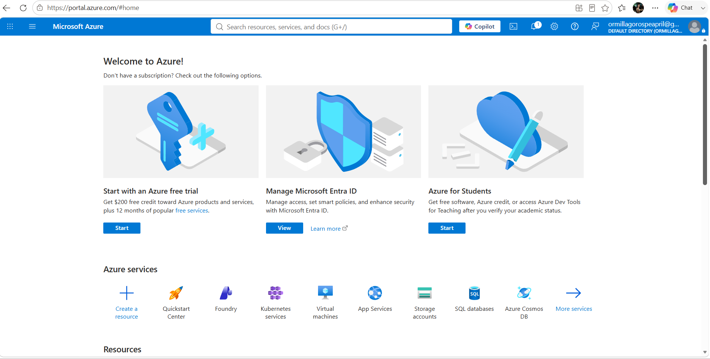

# Microsoft Azure Research

## Brief Overview
Microsoft Azure is Microsoft’s cloud platform, strongly integrated with Microsoft software products and enterprise tools. It is widely adopted by organizations already using Windows, Microsoft 365, and .NET.

## Global Infrastructure
Available in 60+ Regions worldwide — more regions than any other provider. Strong presence in enterprise-heavy markets and government zones.

## Cloud Management Console
Accessible at **portal.azure.com** — a clean, web-based portal with both visual and code-based management tools.

## Four Core Services
1. **Azure Virtual Machines** — Windows and Linux virtual servers in the cloud.
2. **Azure Blob Storage** — Scalable object storage for unstructured data.
3. **Azure Virtual Network** — Secure private networks and cloud connections.
4. **Entra ID (Azure Active Directory)** — Cloud identity and access management.

## Three Advantages
- Seamless compatibility with Windows Server, Microsoft 365, Active Directory, and .NET.
- Unified tools for easy hybrid cloud setup.
- Integrated AI and analytics built into familiar Microsoft workflows.

## Typical Enterprise Use Cases
- Migrating Windows-based infrastructure to the cloud.
- Hybrid cloud connecting local servers to Azure.
- Enterprise software, Microsoft 365 extensions, and .NET applications.
- Government and regulated industries needing strong compliance.

## Screenshot

