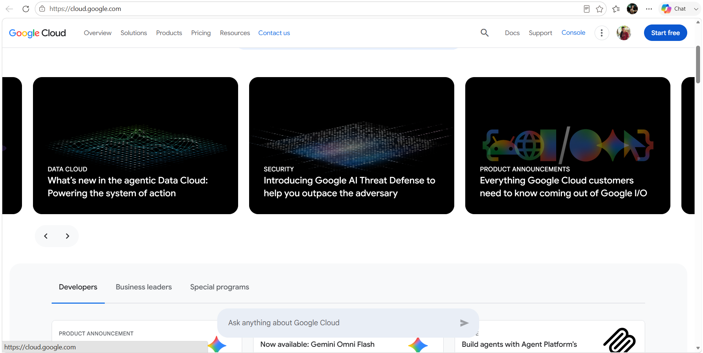

# Google Cloud Platform (GCP) Research

## Brief Overview
Google Cloud Platform is Google’s cloud offering, built on the same infrastructure that powers Google Search, YouTube, and Gmail. It leads in containers, Kubernetes, open-source innovation, and AI/ML.

## Global Infrastructure
Spans 30+ Regions — features Google’s high-speed private global fiber network and software-defined networking.

## Cloud Management Console
Accessible at **console.cloud.google.com** — a developer-friendly interface with clean navigation.

## Four Core Services
1. **Compute Engine** — High-performance, cost-effective virtual machines.
2. **Google Cloud Storage** — Unified object storage with multiple storage classes.
3. **Virtual Private Cloud** — Globally scalable, software-defined networking.
4. **Cloud IAM** — Fine-grained permission and resource management.

## Three Advantages
- Industry leader in containers and Kubernetes.
- Strong open-source culture and competitive pricing.
- Cutting-edge AI/ML tools built on Google’s own technology.

## Typical Enterprise Use Cases
- Cloud-native microservices and Kubernetes workloads.
- AI, machine learning, and large-scale data analytics.
- High-growth startups and modern SaaS companies.
- Global applications requiring ultra-fast networking.

## Screenshot

